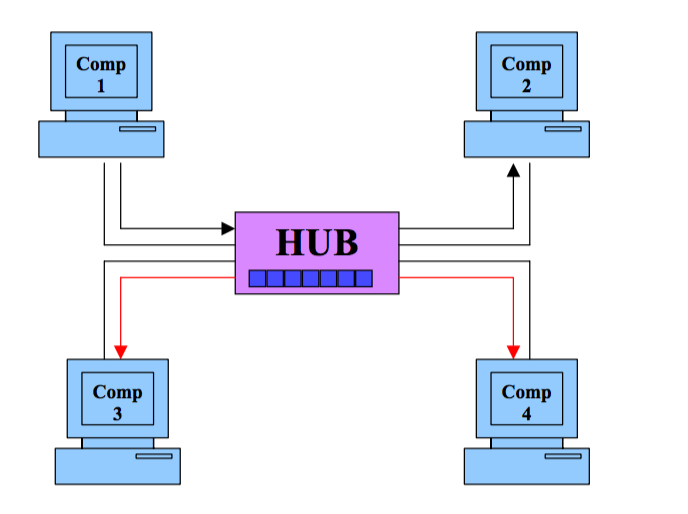
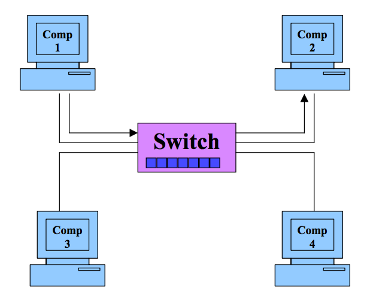
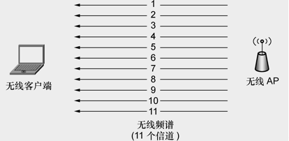
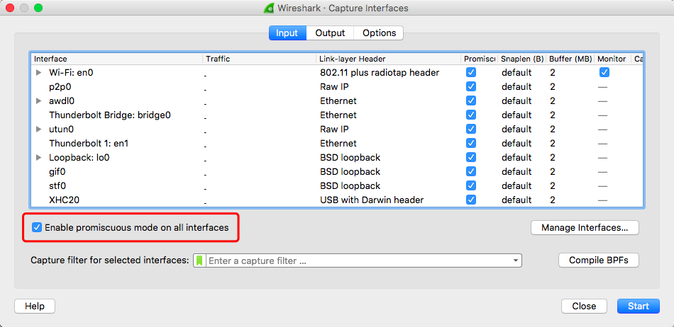
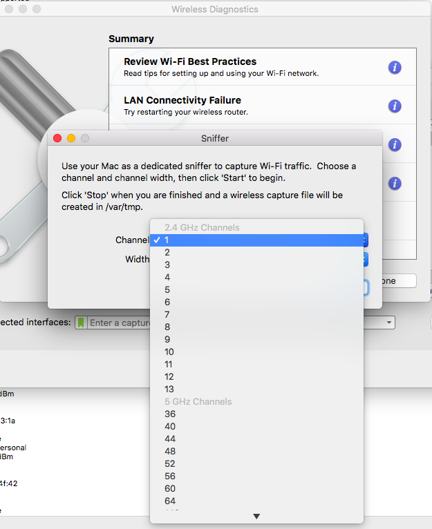

# 关于抓包的一点思考

## 什么是抓包
首先了解什么是抓包，直接搜索抓包会发现只有百度百科有相关的词条，在维基百科上抓包相关的词条，[百度百科](https://baike.baidu.com/item/%E6%8A%93%E5%8C%85) 是这样解释的：

>抓包（packet capture）就是将网络传输发送与接收的数据包进行截获、重发、编辑、转存等操作，也用来检查网络安全。

但就字面意思而言，抓包就是截取网络数据包，重发、编辑和转存等操作应该是抓包之后对数据包的处理，并不在抓包的范畴之内，所以我觉得这里给出的定义并不是很合理。

将上面的百科的抓包定义中抓包的英文名作为关键字查询试试看，结果有一个连接是相关的定义：[Packet Capture](https://www.techopedia.com/definition/25333/packet-capture) ：
>Packet capture is a computer networking term for intercepting a data packet that is crossing or moving over a specific computer network.

对应的翻译:
>抓包是拦截在特定的计算机网络上传输或经过的数据包的特定术语。

相比百科给出的解释，上面的定义就比较准确了，接下来分析下抓包的原理。

## 抓包原理浅析
先复习一下计算机网络中的数据包是如何传输的。相关的两个重要的概念就是MAC地址和IP地址(关于这两个地址不做过多介绍，有需要可自行查阅资料)。数据包表面上是从一个ip发送到另一个ip，但实际上在数据链路层发送数据包的时候是依据MAC地址，如果不知道目标主机的IP地址，则可以通过ARP来获取，然后将获取的MAC地址写入到数据帧中就可以发送了，以上就是简单的发送数据包原理。

那么如何实现数据包的拦截，按照不同的连接情况拦截的原理也有些不同，下面是相关场景及抓包原理：

### 1. 共享以太网
在共享以太网环境中，所有的主机连接到同一个集线器上争夺带宽。在这样的环境中，发给其中一台主机的包也会被其余的主机接收，理论上其余的主机在对比数据包的目的MAC地址后会将其丢弃，但是运行嗅探器(也就是俗称的抓包软件)的机器会不遵守这个规则接收所有的数据包。运行嗅探器的机器被设置为了混杂模式(promiscuous mode)，可以监听网络上的所有数据包。处于共享以太网环境中的嗅探器是完全被动的，因此很难被检测到。下面是具体的例子：

[comp1和comp2之间的交流数据包能够被comp3和comp4接收，其他主机之间交流的数据包也能够被没有参与交流的主机捕获]

### 2. 交换以太网
交换以太网就是所有主机都连接到一台交换机形成的网络环境。交换机中有维护一份ARP映射表，存放着主机的MAC地址以及对应的交换机端口。也因为如此，当主机之间需要进行交流时，会先将数据帧传送给交换机，交换机根据数据帧中目标主机的MAC地址，将数据帧经由对应的端口转发给正确的主机。相比较与共享以太网中的广播而言，交换机并不会将数据帧广播给其他的主机，因此其余主机即便是处于混杂模式，也无法捕获数据包。具体场景如下：

[comp1和comp2交流的数据帧无法被comp3和comp4接收，其他主机之间的数据帧交流只有对应的目标主机才可以接收到]

尽管交换机相比集线器更为安全一些，但是以下两种方案还是可以捕获交换机以太网中传输的数据帧：

#### I ARP欺骗
ARP是无状态的，因此你可以在没有任何主机向你查询MAC地址时发送一个ARP应答报文，其他的主机也会接收。所以当你需要捕获某台主机的数据包时，你可以利用ARP欺骗来绕过网关，也就是让目标主机认为你的主机才是正确的网关地址，之后所有发送给网关的数据包都会经过你的主机。另外一种ARP欺骗的方式是将网关的MAC地址设置为FF:FF:FF:FF:FF:FF，此时网关类似于共享以太网一样会广播所有的数据包。

#### II MAC洪泛
前面有提到交互机会保存一份ARP映射表，以此来映射所连接的主机的MAC地址和端口之间的对应关系。而用来存储映射表的内存空间有限，MAC洪泛正是利用这个内存有限的缺点来持续轰炸交换机，即发送假的ARP应答数据包来让交换机过载。在过载状态下，交换机就类似于共享以太网中的集线器，广播经过自身的所有数据包，而此时也就很容易捕获这个网络环境中的数据报文了。

PS:这种方式会影响交换机的性能，不建议经常使用。

#### III. WLAN
当从无线局域网（Wireless Local Area Network，WLAN）捕获流量时，最特殊的莫过于无线频谱是共享介质。不像有线网络的每个客户端都有它自己的网线连接到交换机，无线通信的介质是客户端共享的空间。由于单个WLAN只占用802.11频谱的一部分，这也意味着允许同一个物理空间的多个系统在频谱不同的部分进行操作。空间上的分离是通过将频谱划分为不同信道实现的。一个信道只是802.11无线频谱的一部分。在美国，有11个信道可用（有些国家允许使用更多的信道）。这是很重要的，因为WLAN同时只能操作一个信道，就意味着我们只能同时嗅探一个信道，如下图所示。所以，如果你要处理信道6的WLAN，就必须将系统配置成捕获信道6的流量。

当前由于信道间有重合的现象，所以你在抓信道6的WLAN时，也有可能抓到其他信道的包。如下图：

所以要捕获WLAN上的包，只需要把主机的网卡设置为混杂模式(promiscuous mode)就可以接收到相关信道中传输的数据包了。

PS：传统的无线嗅探只能同时处理一个信道，但有一个例外：某些无线扫描应用程序使用“跳频”技术，可以迅速改变监听信道以收集更多数据。其中最流行的工具是[Kismet](http://www.kismetwireless.net/)，可以每秒跳跃10个信道，从而高效地嗅探多个信道。

### 3. 如何抓包
在基本了解抓包原理之后，如何抓包实际上就变成了如何实践。而实践，其实就是使用各类软件去实现数据包的拦截。下面我会简单介绍下常用抓包软件及使用过程中一些需要注意的地方。

#### wireshark
wireshake的界面相当友好，操作起来也比较容易。直接操作对应的菜单项就可以实现抓包，这里不细说具体的操作。在点击设置的时候回弹出的对话框：

这里注意红色方框对应的选项: Enable promiscuous mode on all interfaces，这个选项的意思是说开启 __混杂模式(promiscuous mode)__ ，也就是我们在上面说到的网卡的混杂模式，默认开启之后wireshark就会监听所有的当前信道(当前所连接的无线路由器所在的信道)的所有数据包。开始抓包以后，抓到的数据包会自动显示在wireshake的主面板中，就可以根据自己的需要去分析对应的数据包了。

wireShark最强大的功能应该是它的过滤功能，因为特定的信道上极短的时间内也会有捕获到大量的数据包，包含了TCP，UDP，ICMP，HTTP等等各种协议的数据包，而过滤器正是用来筛选数据包，获取有用信息。下面列举一些常用的过滤器类型：
* ip.src == 10.2.189.0 or ip.dst == 10.2.189.0 从 10.2.189.0 发送或者目的地址是 10.2.189.0 的封包(封装好的数据包)

* tcp dst port 3128 显示目的TCP端口为3128的封包。

* ip src host 10.1.1.1 显示来源IP地址为10.1.1.1的封包。

* host 10.1.2.3 显示目的或来源IP地址为10.1.2.3的封包。

* src portrange 2000-2500 显示来源为UDP或TCP，并且端口号在2000至2500范围内的封包。

* not imcp 显示除了icmp以外的所有封包。（icmp通常被ping工具使用）

* src host 10.7.2.12 and not dst net 10.200.0.0/16 显示来源IP地址为10.7.2.12，但目的地不是10.200.0.0/16的封包。

这里有一个问题，wireshake只能抓取当前信道的包，那么想抓取其他信道的包应该怎么办呢？这里提供两种解决方案：
* 改变信道：mac下有自带的airport utility命令来改变路由器的信道，不过只有 **Apple Airport Extreme, Airport Express, Time Capsule routers** 这几种路由器才可以被检测到。这种情况具体参考下面的链接：[airport utility](https://support.zen.co.uk/kb/knowledgebase/broadband-how-to-change-the-wireless-channel-on-your-apple-airport-router)

* mac无线诊断工具抓包 + wireshark读取：mac下自带的无线诊断工具可以自选信道抓包，并且会将抓到的包放在 /var/tmp 目录下，用wireshark读取即可，如下图：

可以自由选择信道来抓取对应的数据包，除了标准的11中2.4GHZ信道之外还支持5GHZ，5.8GHZ等很多种信道。

#### tcpdump
>tcpdump 是一个运行在命令行下的嗅探工具。它允许用户拦截和显示发送或收到过网络连接到该计算机的TCP/IP和其他数据包。

也正是因为命令行操作，所以tcpdump主要被用于linux，unix等操作系统上，并没有对应的友好图形化界面用于解读。常见用法是用tcpdump的命令来过滤得到最终需要的数据包，存储在对应的文件中，之后利用windows上的wireshark来解读。主要也是通过各种命令行参数来过滤需要的数据包。具体使用方式参见官网：[tcpdump](http://www.tcpdump.org/)

#### Charles
Charles是mac下常用的网络抓包工具，支持http及https协议，多用于移动端调试。Charles 通过将自己设置成系统的网络访问代理服务器，使得所有的网络访问请求都通过它来完成，从而实现了网络封包的截取和分析。需要注意的是，移动端抓包需要手动将移动设备的代理设置为Charles的代理ip和端口，否则无法抓包，而且在抓取HTTPS协议的时候需要在Charles以及对应的移动设备上安装对应的证书才可以。

**PS：Chaeles在开启vpn时无法正常抓包**
原因：vpn的原理也是代理，与Charles的代理冲突
解决方案：在 Charles 的 External Proxy Settings 中，设置翻墙的代理端口以及相关信息。同时，我们也要关闭相关翻墙软件的自动设置，使其不主动修改系统代理，避免 Charles 失效。

#### postman
作为一个前端开发，应该不会对postman感到陌生。不过可能熟悉的是chrome的postman插件，但是实际上postman有自己的native app，而且功能更加强大，可以整个系统的请求代理和移动端代理，原理和Charles类似，都是将自己作为代理来实现HTTP请求的拦截。不过由于网站开启了 [HSTS](https://zh.wikipedia.org/wiki/HTTP%E4%B8%A5%E6%A0%BC%E4%BC%A0%E8%BE%93%E5%AE%89%E5%85%A8) 设置，postman无法抓取对应的请求，所以理论上可以只能抓取系统和移动设备上的HTTP请求数据包。

关于抓包工具就介绍到这里，其实还有很多优秀的抓包工具如aircrack-ng、Kismet、Fidder等没有介绍，主要是因为原理比较相近，而且也没有对应时间来研究得相当全面，所以只是大概介绍下。其实通过上面的介绍可以看出wireshark，tcpdump主要比较适用于于计算机网络方向，而Charles和postman主要适用于应用方向，可以说前面两个是在网络层抓包，而后面两个则是在应用层抓包。并没有谁好谁坏的差别，在使用的时候考虑对应的场景选择最合适的工具即可。

### 总结
整篇文章在大致是以“网络层”的角度来解释“应用层”的原理，讲的范围比较宽泛，内容也比较浅显。写的过程就感觉很多地方如通过数据包分析网络状况和系统安全，Charles 抓取HTTPS原理，如何防止被抓包等都可以展开去讲，这里感觉和主题相关性不是很大所以就只是待过，有兴趣可以自己去研究。欢迎纠错指正。

### 参考资料
1. [无线局域网嗅探技术原理分析](http://blog.sina.com.cn/s/blog_7479f79901010046.html)
2. 《wireshake数据包分析实战》
3. 《sniffers》
4. [WLAN信道列表](https://zh.wikipedia.org/wiki/WLAN%E4%BF%A1%E9%81%93%E5%88%97%E8%A1%A8)
5. [macbook + wireshark](http://kms.h3c.com/View.aspx?id=50088)
