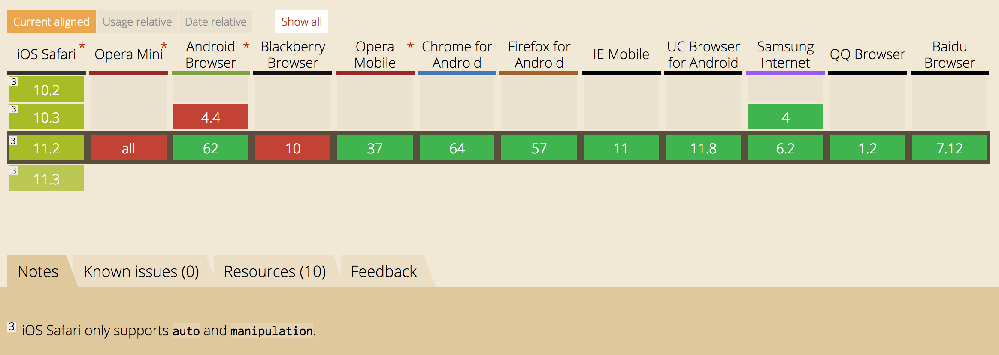

```bash
# 此页面贡献者：树
```
# 解决移动端点击300ms的延迟

## 产生原因

简单来说，就是移动端浏览器有双击放大的功能，浏览器在 `touchend` 和 `click` 之间延迟 300ms 以观察你是否是想要双击放大网页还是单击。

## 解决方法

### user-scalable=no

```html
<meta name="viewport" content="user-scalable=no">
<meta name="viewport" content="initial-scale=1,maximum-scale=1">
```

简单粗暴的直接禁止缩放，不推荐使用。


### width=device-width

```html
<meta name="viewport" content="width=device-width">
```

上面的代码将 `viewport` 的宽度和设备宽度设置为相同的值，这样浏览器就会认为网页元素尺寸合适，你不需要双击放大功能了。

```css
html {
  touch-action: manipulation;
}
```

除了上面的方法，你还可以在 css 中添加以上代码以达到相同的效果，兼容性尚可。



### fastclick

除了以上几种方法之外，你还可以通过引入 `FastClick` 库来解决这个问题，使用方法详见：[FastClick](https://github.com/ftlabs/fastclick)。

`FastClick` 的核心原理就是在 `touchend` 的时候通过 `MouseEvent.initMouseEvent()` 触发一个自定义事件模拟 `click`。代码如下：

```javascript
FastClick.prototype.sendClick = function(targetElement, event) {
    var clickEvent, touch;

    // On some Android devices activeElement needs to be blurred otherwise the synthetic click will have no effect (#24)
    if (document.activeElement && document.activeElement !== targetElement) {
        document.activeElement.blur();
    }

    touch = event.changedTouches[0];

    // Synthesise a click event, with an extra attribute so it can be tracked
    clickEvent = document.createEvent('MouseEvents');
    clickEvent.initMouseEvent(this.determineEventType(targetElement), true, true, window, 1, touch.screenX, touch.screenY, touch.clientX, touch.clientY, false, false, false, false, 0, null);
    clickEvent.forwardedTouchEvent = true;
    targetElement.dispatchEvent(clickEvent);
};
```

