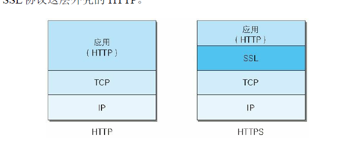
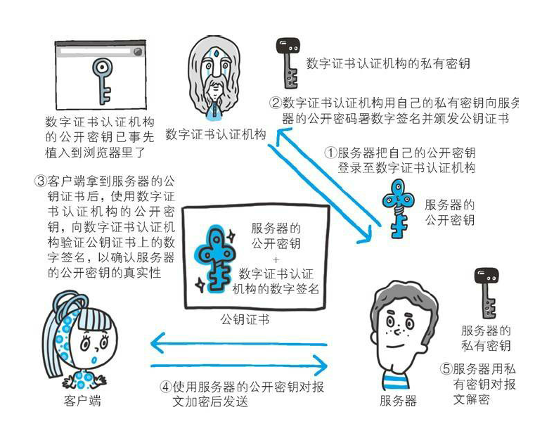

## HTTPS

在讲解HTTPS之前，我们要先说一下HTTP的缺陷，这样才能够了解到HTTPS出现的意义

#### HTTP的缺陷

##### 通信使用明文（不加密），内容可能会被窃听

由于 HTTP 本身不具备加密的功能，所以也无法做到对通信整体（使
用 HTTP 协议通信的请求和响应的内容）进行加密。即，HTTP 报文
使用明文（指未经过加密的报文）方式发送。
##### TCP/IP 是可能被窃听的网络

- 按照TCP/IP协议族的工作机制，通信内容在所有的通信线路上都有可能遭到窥视
- 在互联网的通信线路上的某些网络设备、光缆、计算机等都不可能是个人的私有物，所以不排除某个环节中会遭到恶意窥视行为
- 即使已经加密处理的通信，也会被窥视到通信内容。
- 

##### 加密处理防止被窃听

- 通信加密
  - HTTP协议中没有加密机制，但可以通过和SSL（Secure Socket Layer，安全套接层）或TLS（Transport Layer Security，安全层传输协议）的组合使用，加密HTTP的通信内容
  - 用 SSL 建立安全通信线路之后，就可以在这条线路上进行 HTTP
    通信了。与 SSL 组合使用的 HTTP 被称为 HTTPS（HTTP
    Secure，超文本传输安全协议）或 HTTP over SSL。
  - 
- 内容加密
  - 由于 HTTP 协议中没有加密机制，那么就对 HTTP 协议传输的内容本身加密。即把HTTP 报文里所含的内容进行加密处理。但是要求客户端和服务器同时具备加密和解密机制。

##### 不验证通信方的身份，因此有可能遭遇伪装

##### 任何人都可以发起请求

- 由于HTTP协议通信时，不存在确认通信方的处理步骤，任何人都可以发起请求，另外。服务器只要接收到请求，不管对方是谁都会返回一个响应。会存在安全隐患
  - 无法确定请求发送至目标的Web服务器是否是按真实意图返回响应的那台服务器。有可能是已伪装的Web服务器
  - 无法确定响应返回的客户端是否是按真实意图接收响应的那个客户端。有可能是已伪装的客户端
  - 无法确定正在通信的对方是否具备访问权限。因为某些Web服务器上保存着重要的信息，只想发给特定用户通信的权限。
  - 无法判断请求是来自何方、出自谁手
  - 即使是无意义的请求也会照单全收。无法阻止海量请求下的 DoS 攻击（Denial of Service，拒绝服务攻击）。
- 查明对手的证书
  - 虽然使用 HTTP 协议无法确定通信方，但如果使用 SSL 则可以。SSL 不仅提供加密处理，而且还使用了一种被称为证书的手段，可用于确定方。
  - 证书由值得信任的第三方机构颁发，用以证明服务器和客户端是实际存在的。另外，伪造证书从技术角度来说是异常困难的一件事。所以只要能够确认通信方（服务器或客户端）持有的证书，即可判断通信方的真实意图。
  - 

##### 无法证明报文的完整性，所以有可能已遭篡改

- 接收到的内容可能中途被人篡改。也有可能有中间人攻击，拦截了请求与响应
- 防止篡改：虽然有使用 HTTP 协议确定报文完整性的方法，但事实上并不便捷、可靠。其中常用的是 MD5 和 SHA-1 等散列值校验的方法，以及用来确认文件的数字签名方法。

## HTTPS = HTTP + 加密 + 认证 + 完整性保护

HTTPS并非是应用层的一种新协议，只是HTTP通信接口部分用SSL和TLS协议代替而已。

在采用SSL后，HTTP就拥有了HTTPS的加密、证书和完整性保护这些功能。

SSL 是独立于 HTTP 的协议，所以不光是 HTTP 协议，其他运行在应用层的 SMTP 和 Telnet 等协议均可配合 SSL 协议使用。可以说 SSL 是当今世界上应用最为广泛的网络安全技术。

### SSL 采用一种叫做公开密钥加密（Public-key cryptography）的加密处理方式。

公开密钥加密使用一对非对称的密钥。一把叫做私有密钥（private key），另一把叫做公开密钥（public key）。顾名思义，私有密钥不能让其他任何人知道，而公开密钥则可以随意发布，任何人都可以获得。

使用公开密钥加密方式，发送密文的一方使用对方的公开密钥进行加密处理，对方收到被加密的信息后，再使用自己的私有密钥进行解密。利用这种方式，不需要发送用来解密的私有密钥，也
不必担心密钥被攻击者窃听而盗走。

另外，要想根据密文和公开密钥，恢复到信息原文是异常困难的，因为解密过程就是在对离散对数进行求值，这并非轻而易举就能办到。退一步讲，如果能对一个非常大的整数做到快速地因式分解，那么密码破解还是存在希望的。但就目前的技术来看是不太现实的。

#### 证明公开密钥正确性的证书

由于无法证明公开密钥本身就是货真价实的公开密钥。所以需要使用数字证书认证机构（CA，Certificate Authority）和其相关机关颁发的公开密钥证书。

业务流程：

- 服务器的运营人员向数字证书认证机构提出公开密钥的申请。数字证书认证机构在判明提出申请者的身份之后，会对已申请的公开密钥做数字签名，然后分配这个已签名的公开密钥，并将该公开密钥放入公钥证书后绑定在一起。
- 服务器会将这份由数字证书认证机构颁发的公钥证书发送给客户端，以进行公开密钥加密方式通信。公钥证书也可叫做数字证书或直接称为证书。
- 接到证书的客户端可使用数字证书认证机构的公开密钥，对那张证书上的数字签名进行验证，一旦验证通过，客户端便可明确两件事：一，认证服务器的公开密钥的是真实有效的数字证书认证机构。二，服务器的公开密钥是值得信赖的。
- 此处认证机关的公开密钥必须安全地转交给客户端。使用通信方式时，如何安全转交是一件很困难的事，因此，多数浏览器开发商发布版本时，会事先在内部植入常用认证机关的公开钥。
- 

> HTTPS相比HTTP会慢2~100倍，因为需要进行加密解密和建立安全通信过程。同时由于使用的证书通常是收费的。所以页面中不会全部使用HTTPS通信

> 参考文献 <图解HTTP> 【日】上野 宣