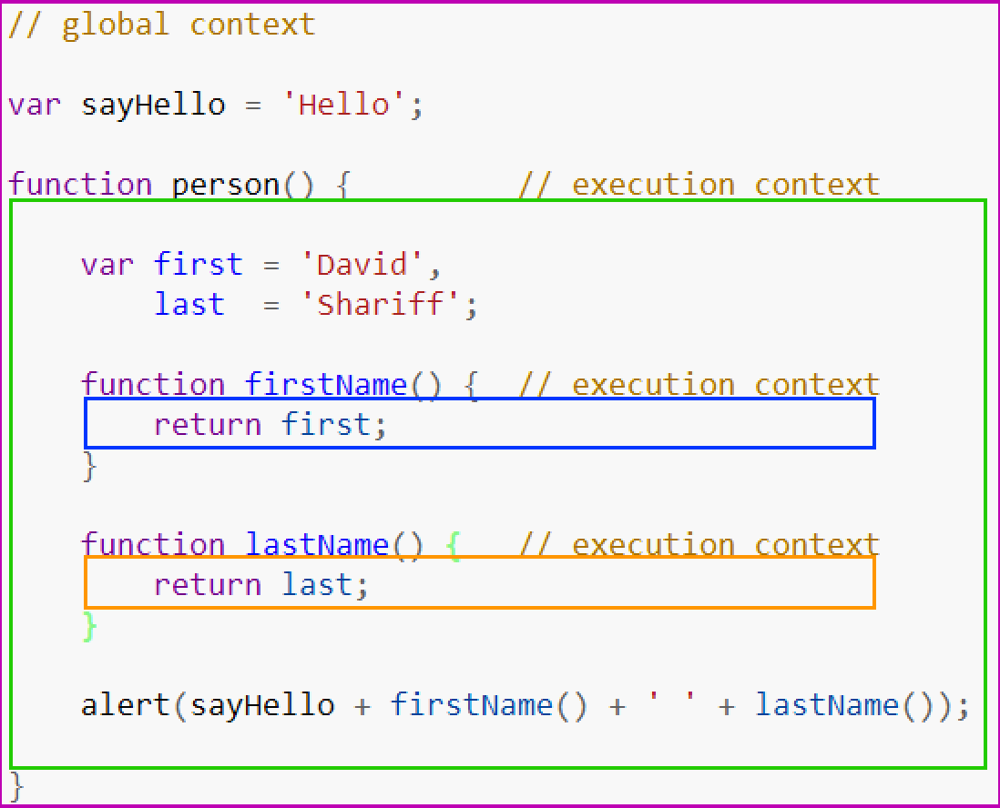
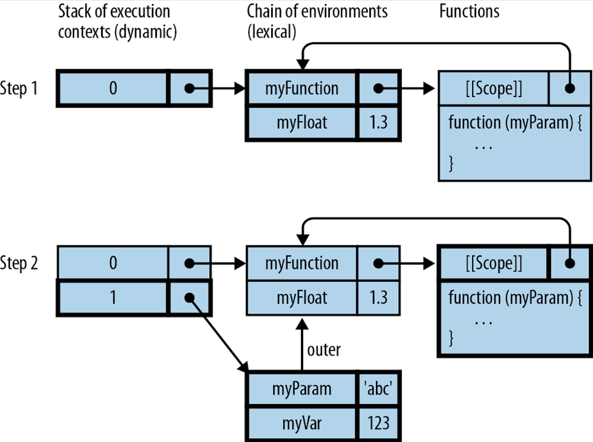

## 执行上下文
跑JavaScript代码时，他在怎么样的`环境`中执行，是十分重要的。首先，可执行代码类型有：
* Global code: The default envionment where your code is executed for the first time.
* Function code: Whenever the flow of execution enters a function body.
* Eval code: Text to be executed inside the internal eval function.

- 

每个函数被调用时，都会创建一个新的执行上下文。对于JavaScript引擎，每次对执行上下文的调用都有两个阶段：
- 创建阶段 [当函数被调用，但还未执行里面的代码]
  - 创建`variables`, `functions`, `arguments`
  - 确定`this`的值
  - 创建作用域链`Scope Chain`
- 激活 / 代码执行阶段
  - 分配值，对函数的引用，执行代码

也就是说，从概念上，我们可以将执行上下文表示为一个具有3个属性的对象：`executionContextObj`，这个对象是在创建阶段生成的：
```javascript
executionContextObj = {
  'scopeChain': {  }, // AO|VO + [[scope]]
  'variableObject': {  }, // function arguments / parameters, inner variable and function declarations
  'this': {}
}
```
以下，就是JavaScript引擎调用某函数时的步骤：[在调用函数之前，创建一个执行上下文]
- 进入创建阶段
  - 创建变量对象VO(variable object)
    - 创建arguments对象，初始化其名称和值，并创建一个副本。
    - 查看上下文中的函数声明
      - 每找到一个函数，在VO中为它创建一个同名属性，并指向内存中相应函数的引用指针。
      - 如果函数名称已经存在，则覆盖重写指针值。
    - 查看上下文中的变量声明
      - 每找到一个变量，在VO中为它创建一个同名属性，并将值初始化为undefined。
      - 如果变量名称已经存在，则不对其执行任何操作并继续查看。
  - 在上下文中确定this的值
  - 初始化作用域链： AO + [[scope]] (  等价于 [AO].concat([[scope]])  )
- 激活 / 代码执行阶段 // Active
  - 在上下文中，运行/解析函数代码，在逐行执行代码过程中，分配变量值。

于是我们再举个栗子：
```javascript
function foo(i) {
  var a = 'hello';
  var b = function funB() {};
  function funC() {};
}

foo(22);

// 在调用foo(22)时，创建阶段: 
fooExecutionContext = {
  variableObject: {
    arguments: {
      0: 22,
      length: 1
    },
    i: 22,
    funC: pointer to function funC()
    a: undefined,
    b: undefined
  },
  this: { ... },
  scopeChain: { ... }
}
```

正如你所看到的，创建阶段会去定义属性的名称，但不会为它们分配值(除了形参/参数)。 一旦创建阶段完成，执行的流程进入第二阶段(激活/代码执行阶段)：
```javascript
fooExecutionContext = {
  variableObject: {
    arguments: {
      0: 22,
      length: 1
    },
    i: 22,
    funC: pointer to function funC()
    a: 'hello',
    b: pointer to function funB()
  },
  this: { ... },
  scopeChain: { … }
}
```

再看一个栗子：
```javascript
(function() {
  console.log(typeof foo); // function pointer
  console.log(typeof bar); // undefined

  var foo = 'hello';
  var bar = function () { return 'world' };

  function foo () { return 'hello' };

}());​
```
* 为什么我们可以在声明之前访问foo？
* foo被声明了两次，为什么typeof foo是函数而不是undefined或者string？
* 为什么bar是undefined？
然而通过上文的学习了解，答案已经显而易见，不再赘述。

## 词法作用域
作用域共有两种主要的工作模型：词法作用域、动态作用域。

无论函数在哪里被调用，也无论它如何被调用，他的词法作用域都是由书写代码时函数声明的位置来决定的。因此当词法分析器处理代码时会保持作用域不变(大部分情况下是这样的)。

## 作用域链
作用域是一套规则，用于确定在何处以及如何查找变量（标识符）。

在查找变量的时候，是先从当前上下文的变量对象（`AO`）中查找，如果没有找到，就会从（`[[scope]]`）父级(词法层面上的父级)执行上下文的变量对象中查找，一直找到全局上下文的变量对象。作用域链正是内部上下文所有变量对象（包括父变量对象）的列表。

作用域链的前端，始终都是当前执行的代码所在环境的变量对象AO。作用域链中的下一个变量对象来自包含(外部)环境，而再下一个变量对象则来自下一个包含环境。这样，一直延续到全局执行环境； 全局执行环境的变量对象始终都是作用域链中的最后一个对象。

内部环境可以通过作用域链访问所有的外部环境，但外部环境不能访问内部环境中的任何变量和函数。这些环境之间的联系是线性、有次序的。每个环境都可以向上搜索作用域链，以查询变量和函数名；但任何环境都不能通过向下搜索作用域链而进人另一个执行环境。

举个栗子：
```javascript
function myFunction(myParam) {
  var myVar = 123;
  return myFloat;
}
var myFloat = 1.3;
// Step 1
myFunction('abc');  // Step 2
```
- 

上图说明了执行代码的时候发生了什么：
1. `myFunction` 和 `myFloat`被存储在全局环境中 (#0)。 需要注意的是，`myFunction`引用的函数对象会通过内部属性[[scope]]指向`myFunction`所在作用域(全局作用域)
2. 执行myFunction('abc’)时，一个新的执行环境 (#1)被创建，其中包含着参数和局部变量。他通过outer属性值(在myFunction.[[scope]]中被初始化)得到了他的外部环境。由此，`myFunction`可以获取到`myFloat`。

也就是说，函数通过内部属性[[Scope]]记录他自身所在的作用域。当一个函数被调用时，会为新进入的作用域创建一个环境，这个环境有一个outer字段，指向外部作用域的环境，并通过[[Scope]]进行设置。因此，始终存在一个环境链，从当前环境开始，继续到他的外部环境，以此类推。 任何链都以全局环境结束。 全局环境outer字段为null。要解析变量（标识符），将从当前环境开始遍历整个环境链。 

[[Scope]]和执行期上下文虽然保存的都是作用域链，但不是同一个东西：[[Scope]]属性是函数创建时产生的，会一直存在；而执行上下文在函数执行时产生，函数执行结束便会销毁。

再举个栗子帮助消化理解：
```javascript
var x = 10;
 
function foo() {
  var y = 20;
 
  function bar() {
    var z = 30;
    alert(x +  y + z);
  }
 
  bar();
}
 
foo(); // 60

// 全局上下文变量对象
globalContext.VO === Global = {
  x: 10
  foo: <reference to function>
};


// 在“foo”创建时，“foo”的[[scope]]属性是
foo.[[Scope]] = [
  globalContext.VO
]

// 在“foo”激活时，“foo”上下文的AO是
fooContext.AO = {
  y: 20,
  bar: <reference to function>
}

// “foo”上下文的作用域链为
fooContext.Scope = fooContext.AO + foo.[[Scope]]
=>
fooContext.Scope = [
  fooContext.AO,
  globalContext.VO
];


// 内部函数“bar”创建时，其[[scope]]为
bar.[[Scope]] = [
  fooContext.AO,
  globalContext.VO
]

// 在“bar”激活时，“bar”上下文的活动对象为
barContext.AO = {
  z: 30
}

// “bar”上下文的作用域链为
barContext.Scope = barContext.AO + bar.[[Scope]]
=>
barContext.Scope = [
  barContext.AO,
  fooContext.AO,
  globalContext.VO
]


// 对“x”、“y”、“z”的标识符解析如下
- "x"
-- barContext.AO // not found
-- fooContext.AO // not found
-- globalContext.VO // found -> 10

- "y"
-- barContext.AO // not found
-- fooContext.AO // found -> 20

- "z"
-- barContext.AO // found -> 30
```

在控制台打印一下用来加深理解一下[[scope]]
```javascript
function first() {

  second();
  console.dir(first);
  function second() {

    third();
    console.dir(second);
    function third() {

      fourth();
      console.dir(third);
      function fourth() {
        console.dir(fourth);
      }
    }
  }
}
```

## 学习资料
[What is the Execution Context & Stack in JavaScript?](http://davidshariff.com/blog/what-is-the-execution-context-in-javascript/)

[speaking JavaScript](http://speakingjs.com/es5/ch16.html)

[深入理解JavaScript系列（14）：作用域链(Scope Chain)](http://www.cnblogs.com/TomXu/archive/2012/01/18/2312463.html)